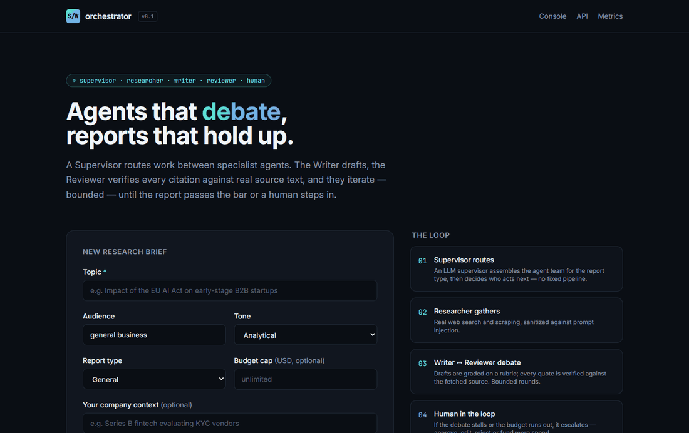
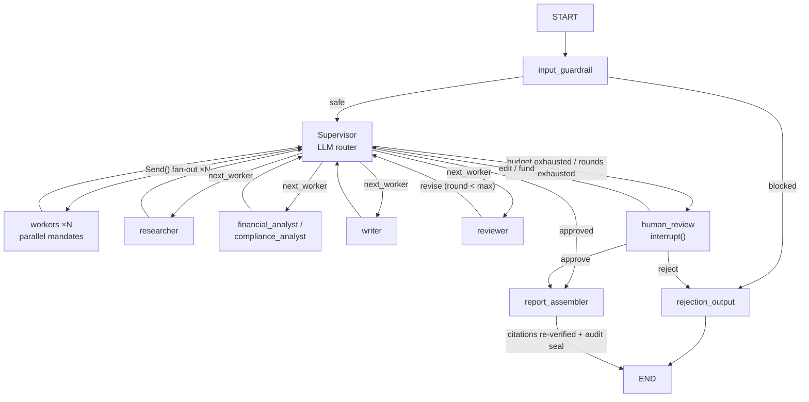
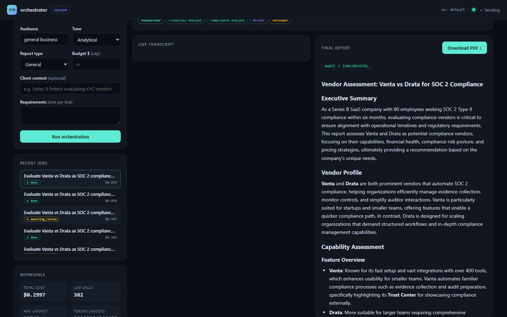
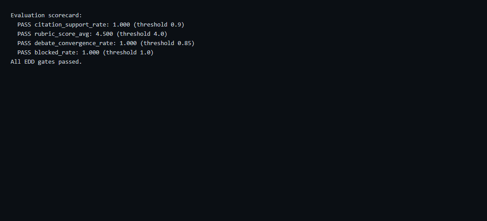
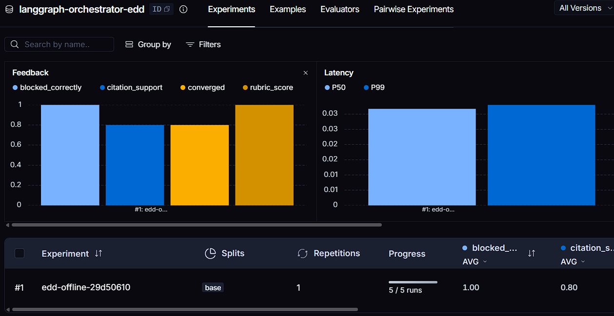
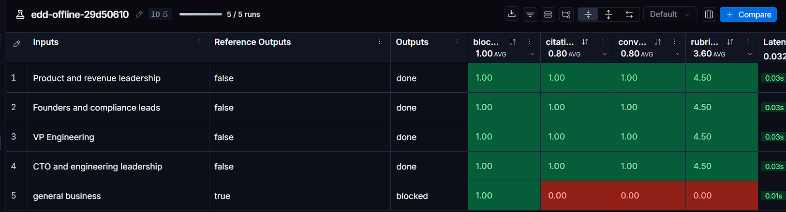
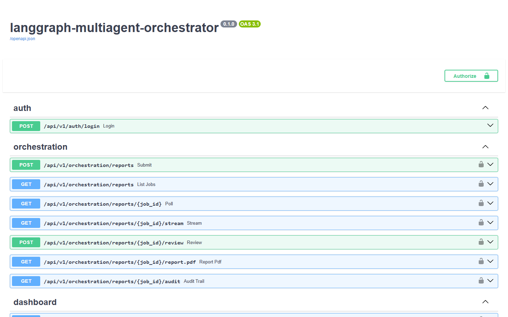

<div align="center">

# 🧭 LangGraph Multi-Agent Orchestrator

**A multi-tenant Supervisor–Workers platform where companies commission auditable B2B reports — the system assembles the right agent team per report type, works in parallel when the Supervisor decides, stays inside the budget you set, and seals every delivery with a cryptographic dossier of the debate that produced it.**

[](https://www.python.org/)
[](https://fastapi.tiangolo.com/)
[](https://github.com/langchain-ai/langgraph)
[](https://github.com/kanderson-ai-dev/langgraph-multiagent-orchestrator/actions/workflows/ci.yml)
[](https://github.com/kanderson-ai-dev/langgraph-multiagent-orchestrator/actions/workflows/ci.yml)
[](https://github.com/astral-sh/ruff)
[](https://mypy-lang.org/)
[](LICENSE)



</div>

---

## 📌 What this is

A **production-shaped, multi-tenant orchestration microservice** built with
FastAPI and LangGraph. A company submits a report brief — topic, report type,
audience, client context, budget cap — and the platform deploys a **team of
specialized agents** chosen for that report type. An LLM **Supervisor** routes
work dynamically (no fixed edges), fans work out in parallel through LangGraph
`Send()` when the mandate calls for it, and drives a bounded **Writer ↔
Reviewer debate** until the draft passes a rubric — or escalates to a human
with the real reason. Every finished job ships a report with verified
citations, a downloadable PDF, and a **SHA-256 hash-chained audit trail** of
the entire debate.

This is the step beyond a fixed planner→workers→critic pipeline: the team,
the routing, and the parallelism are all runtime decisions, the autonomy is
**cost-governed**, and the deliverable is **tamper-evident** — engineered to
the standard of a paid engagement, not a portfolio toy.

---

## 💡 Why this matters — for your project, or for a technical reviewer

- 🧩 **A real framework, not a demo graph.** `app/framework/` holds the
  domain-agnostic Supervisor–Workers primitives (`worker.py`, `supervisor.py`,
  `debate.py`, `registry.py`). The report graph is one concrete assembly —
  adding a specialist is a class plus one registry line.
- 🤖 **Dynamic teams per report type.** `vendor_assessment` deploys
  Researcher + Financial Analyst + Compliance Analyst + Writer + Reviewer;
  `general` deploys the core trio. The Supervisor only routes inside the
  team the brief bought.
- 🧠 **Dynamic routing, not fixed edges.** The Supervisor is an LLM decider
  that sees the live state and picks the next worker — or emits parallel
  `Send()` dispatches under a mandate. Guards against pathological loops are
  structural: per-worker dispatch caps + global bounds + budget enforcement.
- 💰 **Cost-governed autonomy.** A per-job `budget_usd` is enforced *before*
  each dispatch — when the cap is hit the job escalates to a human who can
  **fund and continue**, approve, edit, or reject. The console shows cost by
  agent role in real time.
- 🔁 **A debate that must terminate.** Writer and Reviewer iterate bounded
  rounds (`MAX_DEBATE_ROUNDS`); the Reviewer grades against a rubric and
  verifies citation support. Exhausted rounds escalate — guaranteed
  termination is proven by a dedicated test, not by luck.
- 🔏 **Tamper-evident delivery.** Every transcript entry joins a SHA-256
  hash chain; the report carries its `audit_root`, and
  `GET /reports/{id}/audit` lets anyone re-verify the chain. For B2B
  compliance work, "who said what and when" is cryptographic, not anecdotal.
- 🧑‍⚖️ **Honest human-in-the-loop.** A real LangGraph `interrupt()` on a
  SQLite checkpointer — jobs pause at `awaiting_review`, survive restarts,
  and resume with `Command(resume=...)`. The UI shows *why* it escalated
  (LLM budget vs. debate rounds) and adapts its actions accordingly.
- 🏢 **Multi-tenant from day one.** `workspace_id` scopes every job, event
  and report — one tenant can never read another's work.
- 🧪 **CI green with zero secrets.** 136 tests, 90% coverage on `app/`,
  `mypy --strict`, a browser E2E smoke test — all runnable offline via a
  deterministic `StubLLM` and fixture-based tools. `docker compose up` works
  with no credentials at all.

---

## 🏗️ Architecture



**Dynamic teams by `report_type`:**

| Report type | Deployed team |
|---|---|
| `general` | Researcher, Writer, Reviewer |
| `market_intelligence` | + Financial Analyst |
| `competitive_landscape` | + Financial Analyst |
| `vendor_assessment` | + Financial Analyst, Compliance Analyst |
| `technical_due_diligence` | + Compliance Analyst |

### Two frontend surfaces

| Route | Surface |
|---|---|
| `/` | Minimalist public landing (Tailwind via CDN, no build step). |
| `/console` | Operator console — brief submission, live SSE transcript with Supervisor dispatches and the Writer↔Reviewer debate, HITL review modal, per-role cost panel, sealed report with clickable sources and PDF download. |



---

## 📊 Evaluation-Driven Development (EDD)

Quality thresholds gate CI the same way unit tests do. `evaluation/` contains
a versioned dataset, a deterministic offline harness, and evaluators for the
metrics that matter in this domain.

### Project Goal & Definition of Success

| Dimension | Metric | Success threshold | Latest offline scorecard |
|---|---|---|---|
| Citation faithfulness | Claims backed by real source text | ≥ 0.90 | **1.000** ✅ |
| Task performance | Reviewer rubric (1–5) | avg ≥ 4.0 | **4.500** ✅ |
| Orchestration health | Debate convergence within `MAX_DEBATE_ROUNDS` | ≥ 0.85 | **1.000** ✅ |
| Safety | Adversarial briefs blocked | 1.00 | **1.000** ✅ |
| Latency | Full job wall-clock, live path | p50 ≤ 90s / p95 ≤ 240s | **~105s to HITL/done observed** (was 150–670s before parallel search+scrape) — converged runs land near the p50 target; see Known limitations |
| Cost | Per job (all roles, all rounds) | ≤ $0.08 | **$0.010–$0.104 observed** ✅ (upper end = full 3-round debate + fund) |
| Test coverage | `pytest --cov=app` | ≥ 80% | **90%** ✅ |
| Static typing | `mypy --strict app/` | 0 errors | **0 errors** ✅ |

```bash
uv run python -m evaluation.run_eval   # exits non-zero if any gate fails
```

The offline scorecard measures *pipeline* determinism with a stubbed LLM and
fixture-based tools — guardrails, routing, debate, citation verification and
audit sealing behave correctly without spending a cent. The same metrics run
against the live model with real credentials. Never adjust a badge to look
better than the measured number.



### LangSmith experiment (real eval run)

The same dataset pushed through LangSmith experiments — per-case evaluator
scores, including the `blocked-injection` adversarial case failing loudly in
red exactly as designed:




---

## 🔌 API

| Endpoint | Purpose |
|---|---|
| `POST /api/v1/auth/login` | Issue a short-lived JWT (rate-limited; only when auth is configured) |
| `POST /api/v1/orchestration/reports` | Submit a report brief → `202` + job record |
| `GET /api/v1/orchestration/reports` | List jobs (workspace-scoped) |
| `GET /api/v1/orchestration/reports/{id}` | Poll status, team, cost and result |
| `GET /api/v1/orchestration/reports/{id}/stream` | Live progress via SSE (per-node events, HITL interrupts) |
| `POST /api/v1/orchestration/reports/{id}/review` | HITL decision for `awaiting_review` jobs (`approve` / `edit` / `reject` / `fund`) |
| `GET /api/v1/orchestration/reports/{id}/report.pdf` | Download the final report as a PDF |
| `GET /api/v1/orchestration/reports/{id}/audit` | Hash-chained audit trail for a finished job |
| `GET /api/v1/dashboard/summary` | Workspace cost/token/latency aggregates |
| `GET /health` `/health/ready` `/metrics` | Liveness, readiness, Prometheus exposition |



### curl examples

```bash
# Submit a vendor-assessment brief with a $0.05 cost cap
curl -s -X POST http://localhost:8000/api/v1/orchestration/reports \
  -H "Content-Type: application/json" \
  -d '{
    "topic": "Compare Vanta and Drata SOC 2 evidence practices",
    "report_type": "vendor_assessment",
    "audience": "procurement team",
    "tenant_context": "Fintech scale-up, 120 employees",
    "budget_usd": 0.05
  }'

# Poll status / cost / result
curl -s http://localhost:8000/api/v1/orchestration/reports/<job_id>

# Stream live progress (supervisor dispatches, debate, interrupts)
curl -N http://localhost:8000/api/v1/orchestration/reports/<job_id>/stream

# Resolve a job paused for human review — fund or approve
curl -s -X POST http://localhost:8000/api/v1/orchestration/reports/<job_id>/review \
  -H "Content-Type: application/json" \
  -d '{"action": "fund", "additional_budget_usd": 0.05}'

# Download the sealed report / inspect the audit chain
curl -s -o report.pdf http://localhost:8000/api/v1/orchestration/reports/<job_id>/report.pdf
curl -s http://localhost:8000/api/v1/orchestration/reports/<job_id>/audit
```

---

## 📡 Observability & cost

- **structlog** JSON pipeline, correlated by `job_id`, with automatic
  redaction of `*_key` / `*_token` / `*_password` / `authorization` /
  `*_secret` fields.
- **Prometheus** metrics for job outcomes, durations, tokens by role, and
  per-job cost.
- **Per-job cost accounting**: a context-scoped `UsageTracker` rolls every
  LLM call into `job.cost_usd`, split by agent role in the console.
- **LangSmith**: set `LANGCHAIN_API_KEY` + `LANGCHAIN_TRACING_V2=true` and
  every run is traced — `evaluation/run_eval.py --langsmith` pushes the EDD
  dataset as a versioned experiment.
- **Checkpoints**: LangGraph `AsyncSqliteSaver` per `job_id` — paused jobs
  survive restarts and resume exactly where the `interrupt()` fired.

---

## 🔒 Security posture

Guardrail-first design (hostile briefs are rejected before any paid call),
scraped content treated as data never instructions (OWASP LLM01 — injection
fixtures tested), JWT auth with generic 401s when configured, rate limiting,
security headers middleware, robots.txt-compliant scraper with delays and
size caps, `workspace_id` isolation on every route, and secret hygiene
enforced by `SecretStr`, redacted logs, `.gitignore`/`.dockerignore`
coverage, `gitleaks` + `pip-audit` in CI. Full mapping:
[`SECURITY.md`](SECURITY.md).

---

## 🚀 Quick Start

```bash
uv sync --all-extras
cp .env.example .env        # OPENAI_API_KEY / SEARCH_API_KEY as needed
uv run uvicorn app.main:app --reload
# open http://localhost:8000/          → landing
# open http://localhost:8000/console/  → operator console
```

The app **degrades cleanly with zero secrets**: no LLM key → deterministic
`StubLLM`; no search key → keyless DuckDuckGo (or `SEARCH_PROVIDER=none` for
fully offline); no JWT secret → auth disabled for local dev. CI runs the
entire suite with no secrets at all.

```bash
docker compose up --build   # PORT=8001 docker compose up --build to remap
```

The image is non-root, health-checked, and persists jobs + checkpoints to a
named volume; `.env` is read at runtime — no secrets are baked in.

## ⚙️ Environment Variables

| Variable | Required | Secret? | Purpose |
|---|---|---|---|
| `OPENAI_API_KEY` | no | ✅ | Supervisor + workers LLM; deterministic stub when absent |
| `CHAT_MODEL_NAME` | no | — | Model override (default `gpt-4o-mini`) |
| `SEARCH_PROVIDER` | no | — | `auto` \| `tavily` \| `duckduckgo` \| `none` |
| `SEARCH_API_KEY` | no | ✅ | Tavily key (enables the paid provider) |
| `LANGCHAIN_API_KEY` / `LANGCHAIN_TRACING_V2` | no | ✅ | LangSmith tracing + eval experiments |
| `JWT_SECRET_KEY` / `ADMIN_PASSWORD_HASH` | no | ✅ | Enables JWT auth (else open local dev) |
| `MAX_DEBATE_ROUNDS` | no | — | Writer↔Reviewer cap before escalation |
| `MAX_WORKER_DISPATCHES` | no | — | Per-worker dispatch cap (anti-loop guard) |
| `MAX_SUB_QUESTIONS` | no | — | Researcher query fan-out bound |
| `DEFAULT_JOB_BUDGET_USD` | no | — | Global fallback budget cap per job |

Never commit secrets. See [`.env.example`](.env.example) for the full,
commented template.

## 📁 Project Structure

```
app/
├── framework/         # domain-agnostic Supervisor–Workers primitives
│                      # (worker protocol, LLM supervisor router, bounded
│                      #  debate loop, worker registry)
├── graph/             # report-generation assembly: state, nodes
│                      # (researcher/writer/reviewer/specialists), teams,
│                      # prompts, guardrails, citations, report_assembler
├── api/v1/routes/     # auth, orchestration, dashboard, health
├── core/              # config, security, logging, metrics, cost tracking
└── services/          # llm_client (real + StubLLM), search_client,
                       # scraper_client, job_store, usage_store,
                       # job_runner (SSE), audit (hash chain)
evaluation/            # EDD dataset, evaluators, run_eval, scorecards
frontend/              # `/` landing (Tailwind CDN) + `/console` operator UI
tests/                 # 136 tests — offline by default, incl. browser E2E
docs/screenshots/      # real captures referenced by this README
scripts/               # record_demo.py (GIF), capture_screenshots.py
```

## 🧪 Verification

```bash
ruff check .                                            # lint
mypy --strict app/                                      # types (0 errors)
pytest -v --cov=app                                     # 136 tests, offline, 90%
uv run --with playwright pytest tests/test_frontend_e2e.py  # browser E2E
uv run python -m evaluation.run_eval                    # EDD quality gate
```

CI (`.github/workflows/ci.yml`): ruff → mypy strict → pytest+coverage → EDD
gate → browser E2E → pip-audit → gitleaks, on `pull_request` with
`contents: read`.

## 🛠️ Stack

Python 3.13 · FastAPI · LangGraph (dynamic routing, `Send()` fan-out,
`interrupt()` HITL, `AsyncSqliteSaver`) · LangChain + `langchain-openai` ·
Pydantic v2 / pydantic-settings · httpx + tenacity · BeautifulSoup4/lxml +
pypdf/pdfplumber · aiosqlite · structlog ·
prometheus-fastapi-instrumentator · PyJWT · fpdf2 · pytest/respx · ruff ·
mypy --strict · Playwright · uv · Docker.

## Known limitations & next steps

- **Live latency sits near (not under) the p50 target**: parallel search +
  bounded-concurrency scraping brought wall-clock from 150–670s down to
  ~105s for a full 3-round debate job. The remaining serial cost is the
  Writer↔Reviewer debate itself — sequential by design — plus keyless
  search latency; a paid provider (Tavily) would shave the research phase
  further.
- Approving a budget escalation *before any draft exists* terminates the job
  as `failed` — the report assembler has nothing to seal. A friendlier path
  would convert "approve with no draft" into "fund & continue".
- The audit trail seals the transcript but not yet the evidence payload —
  hashing scraped content hashes would make the dossier fully reproducible.
- In-process rate limiter and SSE bus are single-replica; scaling out needs
  a shared store (e.g. Redis) for both.
- `workspace_id` isolation exists end-to-end, but there is no workspace
  management surface — tenants are implicit, not administrable.
- LLM-as-judge and LangSmith experiments require live credentials; the
  offline scorecard intentionally validates the deterministic pipeline.

---

## 💼 Need this for your own project?

**I build production-shaped agentic AI systems — dynamic multi-agent
orchestration, cost-governed autonomy, guardrail-first design, and the
evaluation/auditability discipline to actually trust them in production.**

If you need agent teams that assemble per task, debate under budget, and
deliver auditable artifacts — I can adapt this exact framework
(`app/framework/` is domain-agnostic by design) to your domain.

This is the fourth and final rung of a four-project Agentic AI portfolio
ladder:

1. `agentic-api` — deterministic single-agent service (guardrails, tool use,
   streaming).
2. `agentic-rag-system` — self-correcting RAG loop (grade → rewrite →
   escalate).
3. `agentic-web-researcher` — hybrid multi-agent: a planner dispatches
   parallel workers, a critic re-plans, a writer synthesizes.
4. **`langgraph-multiagent-orchestrator` (this project)** — a reusable,
   multi-tenant Supervisor–Workers framework: dynamic teams, runtime `Send()`
   fan-out, bounded debate, cost governance, sealed audit trails.

## 📄 License

[MIT](LICENSE)
